# Food Dairy
## Beschreibung
Das Food dairy soll es seinen Benutzern ermöglich Zutaten mit deren Nährwerten zu speicher 
und Rezepte aus diesen zu erstellen um im Endeffekt eine Nährwert tabelle für seine Rezepte zu erhalten. 

## Benutzer Workflow
Zuerst wird der Benutzer gefragt ob er seine Daten Lokal oder aus der Cloud beziehen will. Der Cloud Button ist deaktiviert, da diese Funktion erst in einem Zukünftigen Release erfolgt.

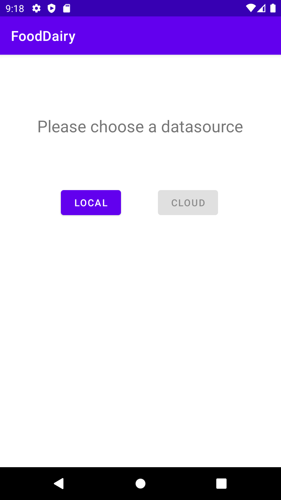

In der App findet man nun eine leere Liste auf sowie in anderen Masken kann man mit dem "Plus"-Knopf ein Element hinzufügen.

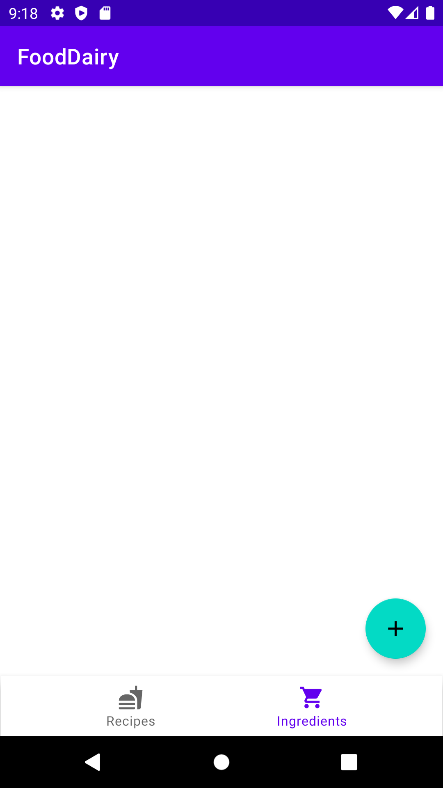

Hier kann man nun einige Werte einfüllen. Dabei ist es so ausgelegt das man die Nährwerte so eingeben kann wie man sie im Internet findet.

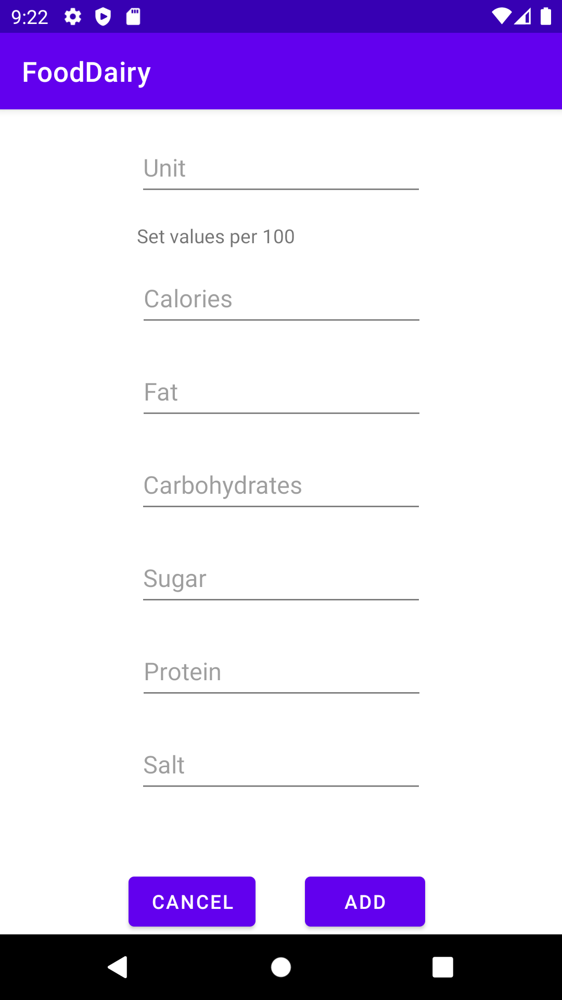

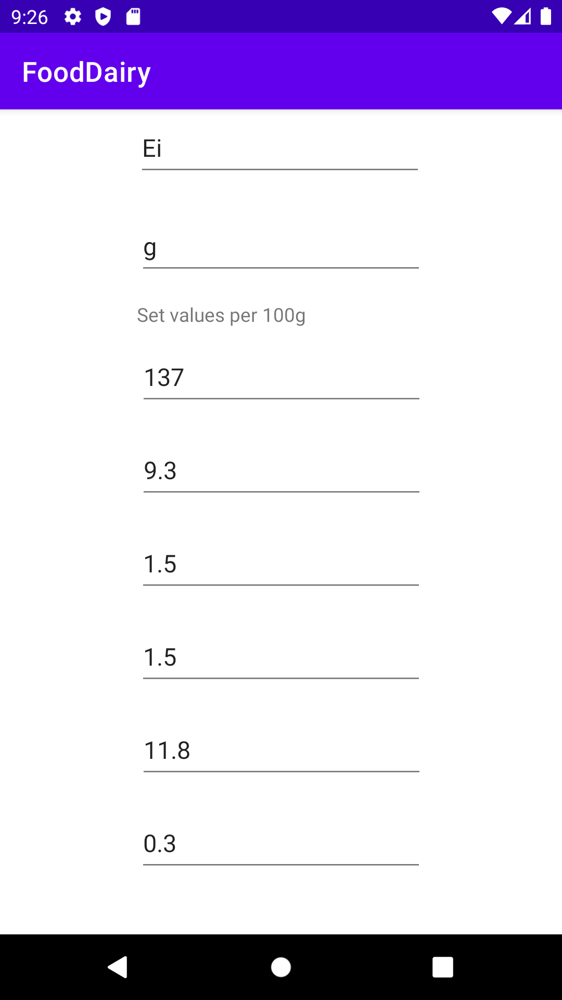

Beim einfügen werden alle Werte die leer gelassen werden mit 0 aufgefüllt ausser bei verpflichtenden Feldern wie Name und Einheit wird darauf aufmerksamgemacht

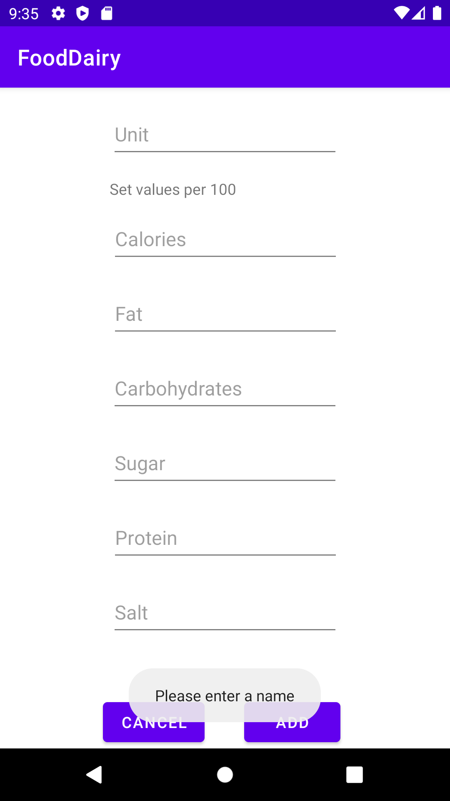
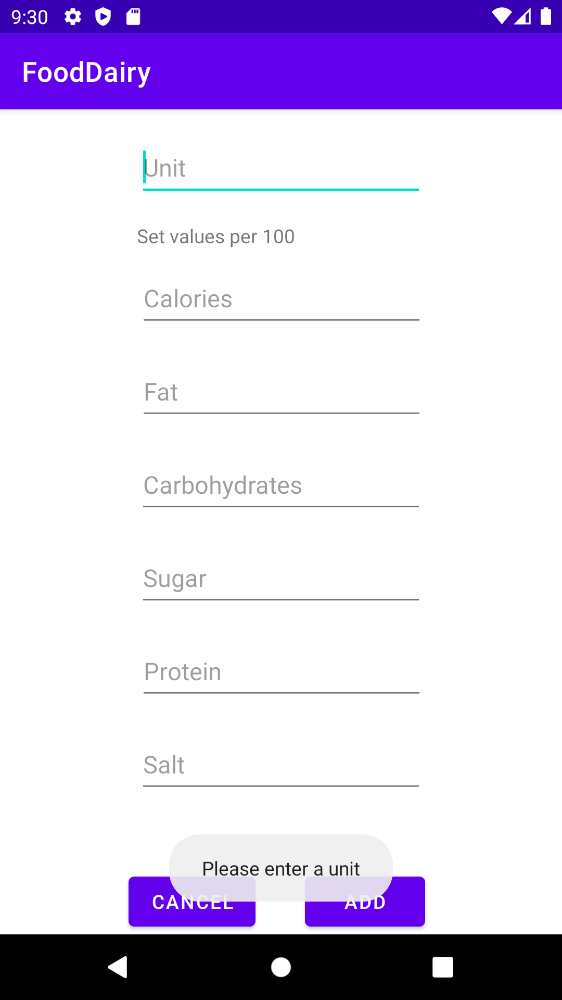

Nach dem einfügen sieht die Zutaten liste so aus:

(Mit dem Mülleimer auf der Seite des Kärtchens kann man elemente wieder entfernen)
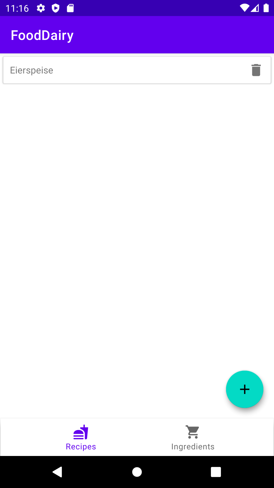

Die Detailansicht einer Zutat sieht so aus:

(Von dort kann man sie auch editieren)

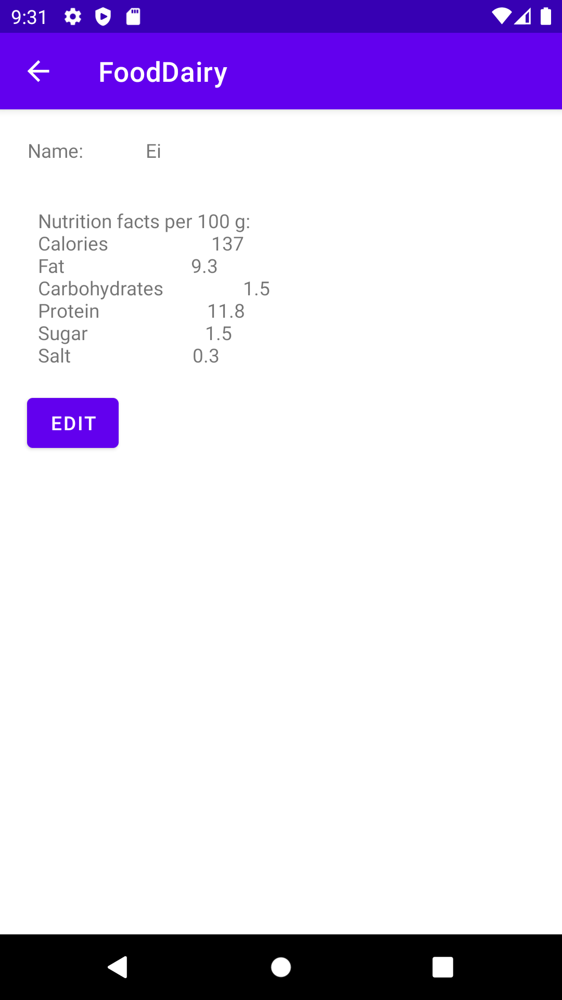

Rezept hinzufügen:

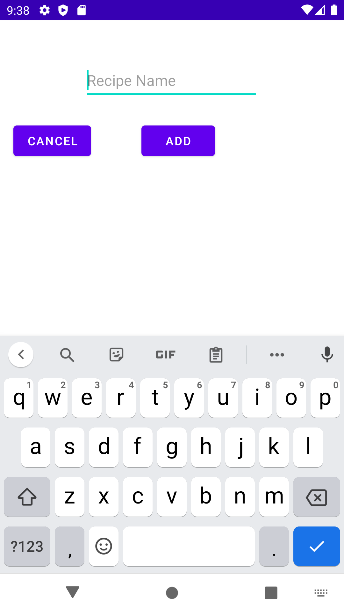

Rezept details angeben: 
Zutat zum Rezept hinzufügen mit Plus

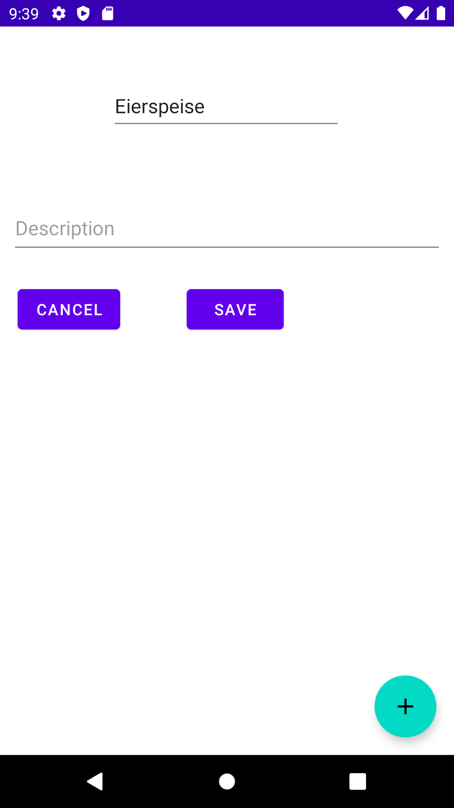

Zutat zum Rezept hinzufügen:

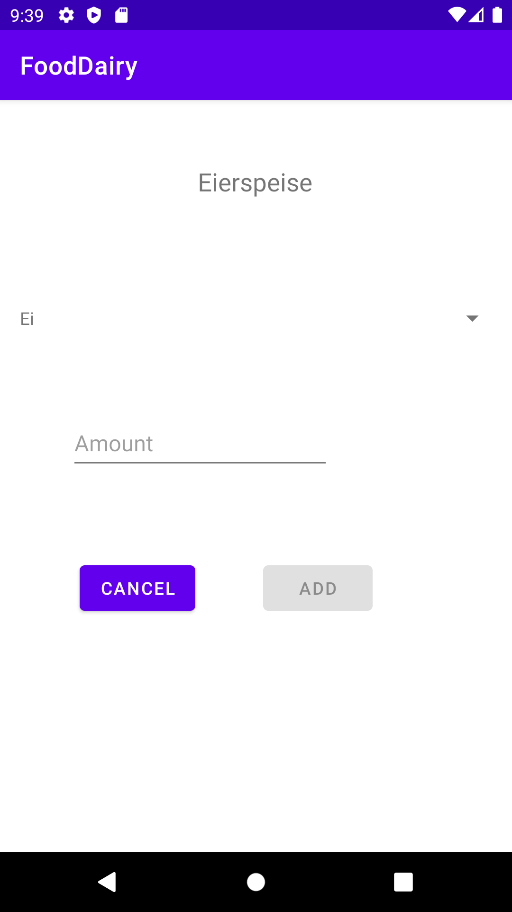

Fehler beim Zutat hinzufügen:

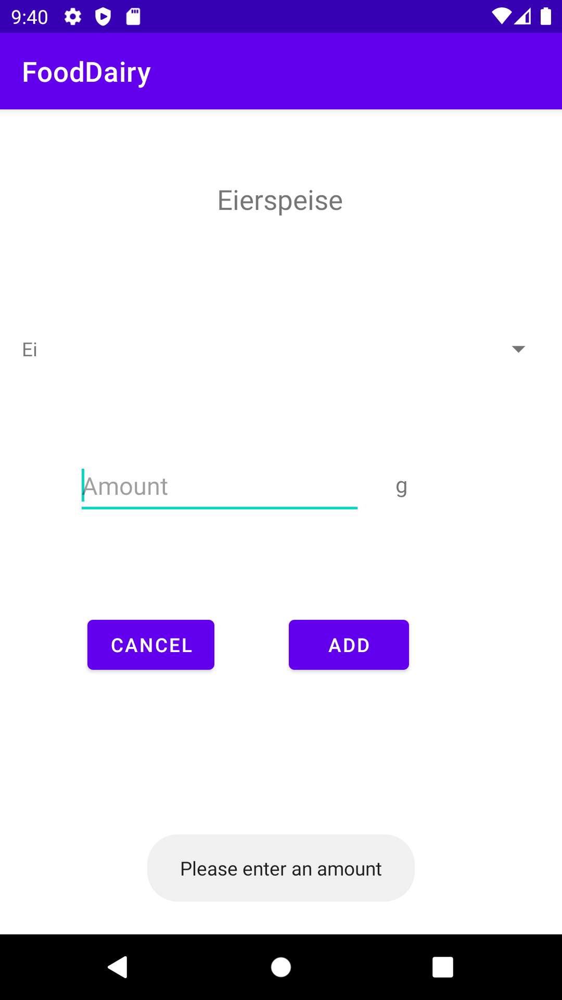

Rezept Nährwerttabelle:

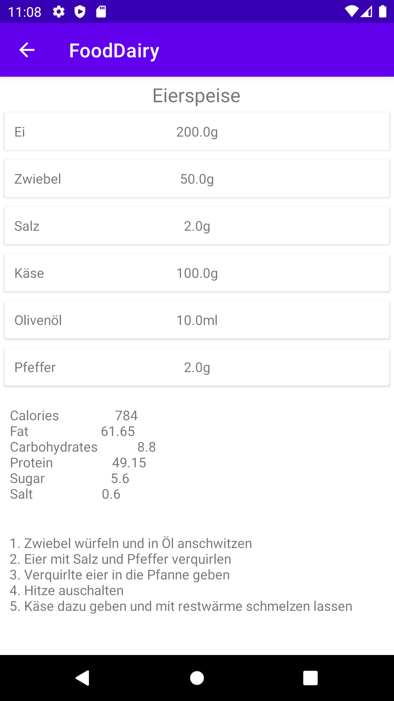

## DatenModel
